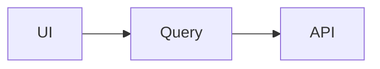

# 🎁 Bonus Pack

## Professional GitHub Bio (pick one, ≤160 chars)

1. `React Frontend Developer · 3+ yrs · TypeScript, Redux Toolkit, React Query, MUI & Tailwind · Building fast, accessible, pixel-perfect UIs`
2. `Frontend Engineer specializing in React + TypeScript · I turn Figma into fast, accessible products · OSS contributor`
3. `React · TypeScript · 3+ years shipping production UIs · Performance & DX enthusiast · Open to collaboration`

## GitHub Taglines (for banner / portfolio hero)

- *"Clean code. Clean interfaces. Always."*
- *"I build interfaces users love and developers can maintain."*
- *"Pixel-perfect on the outside, type-safe on the inside."*
- *"Turning coffee into components since 2022."*

## Profile Banner Ideas

1. **Gradient wave (current setup):** capsule-render animated wave with name + role — zero maintenance.
2. **Custom Figma banner (1280×400):** dark background, name + tagline left, floating React/TS/MUI logos right, subtle grid texture. Export → host in the profile repo → swap into the README.
3. **Terminal mock:** a styled code block banner showing `$ whoami → react-developer` — nerdy and memorable.
4. **Keep-it-simple:** typing-SVG only (already included) — the safest professional look.

## Repository Naming Conventions

- **kebab-case, always:** `react-admin-dashboard`, never `ReactAdminDashboard` or `react_admin_dashboard`.
- **Lead with the tech when it's the point:** `react-hooks-library`, `nextjs-dashboard`; lead with the domain when the product is the point: `expense-tracker`, `movie-search`.
- **No noise words:** drop `-app`, `-project`, `-clone`, `my-`, `-final`. (`netflix-clone` → `movie-streaming-ui`.)
- **Versioning only for real rewrites:** `portfolio-v2` is fine; `todo-v7` is not.

## Repository Topics (5–10 per repo)

Base set: `react` `typescript` `frontend` + per-repo:

| Repo | Topics |
|---|---|
| react-admin-dashboard | `admin-dashboard` `material-ui` `react-query` `redux-toolkit` `data-visualization` `dark-mode` |
| react-ecommerce | `ecommerce` `shopping-cart` `tailwindcss` `stripe` `react-hook-form` `zod` |
| react-hooks-library | `react-hooks` `custom-hooks` `npm-package` `vitest` `tree-shakeable` |
| nextjs-dashboard | `nextjs` `app-router` `server-components` `prisma` `nextauth` |
| frontend-interview-preparation | `interview-preparation` `interview-questions` `javascript` `frontend-interview` |

## Project Labels

See [doc 10](10-github-best-practices.md) — use the same label set in every repo; consistency across repos reads as process maturity.

## Professional README Badges (copy-paste)

```markdown
[](URL)
[](https://github.com/Venkatesh-M-14/REPO/actions)
[](LICENSE)


```

## Markdown Tricks

```markdown
<!-- 1. Center anything -->
<div align="center">…</div>

<!-- 2. Collapsible sections -->
<details><summary>📦 Click to expand</summary>

Hidden content here.
</details>

<!-- 3. Keyboard keys -->
Press <kbd>⌘</kbd> + <kbd>K</kbd> to open the palette.

<!-- 4. Callouts (GitHub-native) -->
> [!NOTE]
> Useful info.
> [!WARNING]
> Careful here.

<!-- 5. Theme-aware images -->
<picture>
  <source media="(prefers-color-scheme: dark)" srcset="dark.png">
  
</picture>

<!-- 6. Side-by-side screenshots via table -->
| Before | After |
|---|---|
|  |  |

<!-- 7. Footnotes -->
Claim.[^1]
[^1]: Source.

<!-- 8. Diagrams without images -->


<!-- 9. Comments (invisible on GitHub) — great for template placeholders -->
```

## Developer Quotes (rotate in READMEs / portfolio)

- *"Simplicity is the soul of efficiency."* — Austin Freeman
- *"Programs must be written for people to read, and only incidentally for machines to execute."* — Abelson & Sussman
- *"Make it work, make it right, make it fast."* — Kent Beck
- *"The best error message is the one that never shows up."* — Thomas Fuchs
- *"First, solve the problem. Then, write the code."* — John Johnson
